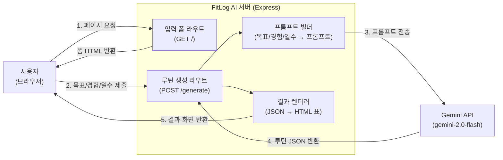

# FitLog AI — 아키텍처 설계 문서

## 1. 개요

FitLog AI는 사용자의 입력(목표, 경험 수준, 운동 가능 일수)을 받아
AI(Gemini API)에게 전달하고, 점진적 과부하가 반영된 1주 운동 루틴을
생성하여 웹 화면에 표시하는 단일 서버 구조의 웹 애플리케이션이다.

별도의 데이터베이스 없이, 요청-응답(stateless) 구조로 동작한다.

## 2. 시스템 구성도

## 3. 컴포넌트 설명

### 3.1 입력 폼 (Form)
- 사용자가 목표(벌크업/다이어트/체력유지), 경험 수준(초보/중급/고급),
  주당 운동 가능 일수를 선택/입력하는 화면
- GET `/` 라우트에서 HTML 폼을 렌더링

### 3.2 루틴 생성 라우트 (Generate)
- POST `/generate` 라우트에서 폼 데이터를 받아 처리
- 입력값 검증 후 프롬프트 빌더로 전달

### 3.3 프롬프트 빌더 (Prompt Builder)
- 사용자 입력값을 기반으로 Gemini API에 보낼 프롬프트 문자열을 구성
- "점진적 과부하" 원칙이 반영된 1주 루틴을 JSON 형식으로 요청

### 3.4 AI 연동 (Gemini API)
- `@google/generative-ai` 패키지를 통해 `gemini-2.0-flash` 모델 호출
- API 키는 환경변수(`GEMINI_API_KEY`)로 관리

### 3.5 결과 렌더러 (Render)
- AI가 반환한 JSON(요일별 운동/세트/횟수)을 파싱하여 HTML 표로 변환
- 사용자에게 보기 쉬운 형태로 결과 화면 제공

## 4. 데이터 흐름

1. 사용자가 웹페이지 접속 → 입력 폼 표시
2. 목표/경험/운동 가능 일수 입력 후 제출
3. 서버가 입력값으로 프롬프트 구성 후 Gemini API 호출
4. AI가 1주치 루틴(JSON)을 반환
5. 서버가 JSON을 표 형태 HTML로 변환하여 사용자에게 표시

## 5. 설계상 특징

- **Stateless 구조**: 별도 DB 없이 요청마다 독립적으로 처리되며,
  서버에 사용자 데이터를 저장하지 않는다.
- **API 비용 효율성**: 1회 요청당 1주 루틴만 생성하여 토큰 사용량을
  최소화한다.
- **환경변수 기반 설정**: API 키 등 민감 정보는 `.env`로 분리하여
  관리한다.

## 6. 향후 확장 시 아키텍처 변화

- DB(SQLite) 도입 시: Render 이후 단계에 "저장(Save)" 컴포넌트 추가,
  사용자별 루틴 히스토리 테이블 구성
- 다주차 플랜 확장 시: Prompt Builder가 이전 주차 결과를 입력으로
  받아 다음 주차 프롬프트에 반영하는 반복 구조로 확장
